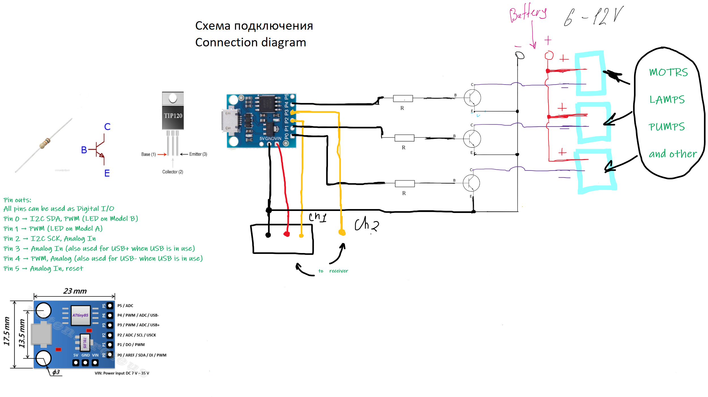

# RC-Switch
 Switch for RC model

The project is included for radio-controlled models. The basis is the Attiny 85 microcontroller. The switch allows you to switch devices with a separate power supply, different from the main on-board power supply.

Required components:
 - Attiny85                       https://ali.ski/pjl5R2
 - Resistor 1K                    https://ali.ski/WSabn
 - Transistor TIP120              https://ali.ski/ivUg7l

Switch #1 always works in on and off mode. 
Switch #2 can operate in two modes:
 - The switch turns on the second device but turns off the first one.
 - The switch turns on the second device and the first device continues to work.

[Connecting and Programming Digispark](http://digistump.com/wiki/digispark/tutorials/connecting)